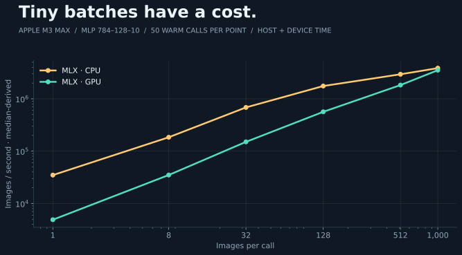

# MNIST latency



| Stack | Implementation | Devices |
| --- | --- | --- |
| Python / NumPy | [compare.py](compare.py): explicit gradients + Adam | CPU |
| PyTorch | [compare.py](compare.py): autograd + Adam | CPU, MPS |
| [MLX](mlx/) | Eager autograd + Adam | CPU, Metal |
| [jax-js](jax-js/) | Compiled forward/gradient + Optax | WASM, WebGPU |
| [Mojo / MAX](mojo-max/) | Compiled graph, explicit gradients + Adam, custom Mojo ReLU | CPU, Metal |

## Measurements

Apple M3 Max; three training trials; 50 inference calls per batch size.

<!-- measurements -->

| Stack / device | Train 3 epochs · ms | Infer 1 · µs | Infer 128 · µs | Infer 1,000 · µs |
| --- | ---: | ---: | ---: | ---: |
| Python / NumPy · CPU | 61.87 | 4.96 | 40.35 | 241.29 |
| PyTorch · CPU | 62.41 | 6.98 | 36.54 | 204.48 |
| PyTorch · MPS | 381.59 | 241.63 | 277.19 | 324.00 |
| MLX · CPU | 89.73 | 25.71 | 56.46 | 228.67 |
| MLX · Metal | 152.84 | 194.54 | 231.12 | 282.65 |
| jax-js · WASM | 1,402.71 | 60.00 | 275.00 | 615.00 |
| jax-js · WebGPU | 1,318.03 | 410.00 | 382.50 | 440.00 |
| Mojo / MAX · CPU | 177.27 | 120.21 | 154.73 | 427.81 |
| Mojo / MAX · Metal | 866.10 | 447.48 | 361.46 | 371.48 |

<!-- /measurements -->

Raw trials, inference samples, versions and compilation timings: [measurements.json](measurements.json).

## Protocol

| Parameter | Value |
| --- | --- |
| Model | 784 → 128 → 10, ReLU, float32 |
| Data | First 10,000 MNIST training images; first 1,000 test images; pixels ÷ 255 |
| Optimizer | Adam: lr 0.001, betas 0.9/0.999, epsilon 1e-8, bias correction |
| Batches | 128; final batch 16; 3 epochs = 237 updates |
| Initialization / shuffle | NumPy seeds 0 / 1; identical arrays and order in every stack |
| Training | Median of 3 fresh trials after discarded warmup updates at both batch shapes |
| Included in training | Per-batch input upload, gradients, optimizer, synchronization |
| Excluded from training | Imports, data preparation, graph compilation, warmup, reset, evaluation |
| Inference | Batches 1, 128, 1,000; 5 warmups, 50 calls; synchronized fresh output |
| Inference weights | Identical initial **untrained** weights; architecture cost, separate from accuracy checks |
| Inference transfers | Inputs resident; input upload and output readback excluded |
| Validation | Initial logits + first Adam update agree with NumPy; trained accuracy ≥85% |
| CPU threads | NumPy/PyTorch: 1; MLX/MAX/browser: runtime defaults |

Local measurements on an Apple M3 Max. Runtime defaults and execution strategies differ; these are the implementations above, not each framework's best achievable speed. First-use timings can reuse compiler/driver caches. Python `setup_seconds` includes imports, setup and initial validation; browser `setup_seconds` measures parameter/optimizer initialization only. They are not comparable startup measurements. MAX compilation is recorded per graph; other first-use work can occur during validation or warmup.

## Reproduce

From this folder, on an Apple-silicon Mac with `uv`, `pixi`, Node.js 22+, Chrome, and Xcode's Metal Toolchain. Run backends sequentially on an idle machine.

```sh
./fetch.sh
uv run --script --locked compare.py --backend numpy
for backend in torch mlx; do
  for device in cpu gpu; do
    uv run --script --locked compare.py --backend "$backend" --device "$device"
  done
done
for device in cpu gpu; do
  pixi run --locked --manifest-path mojo-max/pixi.toml python "$PWD/compare.py" --backend max --device "$device"
done
(cd jax-js && npm ci && npx playwright install chromium && CHROME_CHANNEL=chrome node compare.mjs)
uv run --script --locked plot.py --collect
```

`data/`: downloaded IDX files and generated shared fixture. `results/`: local benchmark outputs. Both are ignored. `plot.py --collect` requires all nine runs with the same fixture hash and three training trials. It updates the committed measurements, result tables and four charts.

## Rebuild charts only

```sh
uv run --script --locked plot.py
```

No training or dataset download required. Each local `README.md` links to its `jade.md`.
