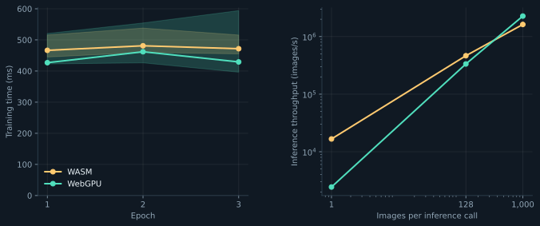

# jax-js



| Implementation | Setting |
| --- | --- |
| Framework | jax-js 0.1.24 + Optax 0.1.2 |
| Execution | WebAssembly or WebGPU; compiled forward/gradient; eager Optax updates |
| Model, optimizer, timing | [Shared protocol](../README.md#protocol) |
| App + comparison | [app.js](app.js) |
| Automated runner | [compare.mjs](compare.mjs) |
| Results | [measurements.json](../measurements.json): `jax-js-wasm`, `jax-js-webgpu` |

## Comparison

From this folder, with Node.js 22+, Chrome, and `uv`:

```sh
../fetch.sh
uv run --script --locked ../compare.py --backend numpy
npm ci
npx playwright install chromium
CHROME_CHANNEL=chrome node compare.mjs
```

The command requests both backends explicitly in installed headless Chrome. Missing WebGPU fails the run; there is no CPU fallback. `node compare.mjs` uses bundled Chromium; WebGPU availability depends on that build. Shared initialization and sample order come from `../data/comparison.json`; both forward logits and the first Adam update are checked against NumPy. Raw results: `../results/jax-js-{wasm,webgpu}.json`.

## Interactive app

```sh
npm start
```

Open the printed local URL. Train, save/reload weights, measure inference, and export measurements. Computation stays in the browser; the server serves local files.

The interactive app uses its own random initialization and sample order. Its training timer includes batch gathering and first-use compilation. Its exported measurements are separate from the controlled comparison above.

## App checks

```sh
npm test
```

Headless UI checks: training, falling loss, inference, weight export/import, scalar-reference logits, malformed-checkpoint rejection. Default: WASM, 512 training images. Outputs: ignored `results/`.

## Chart

```sh
uv run --script --locked ../plot.py
```
