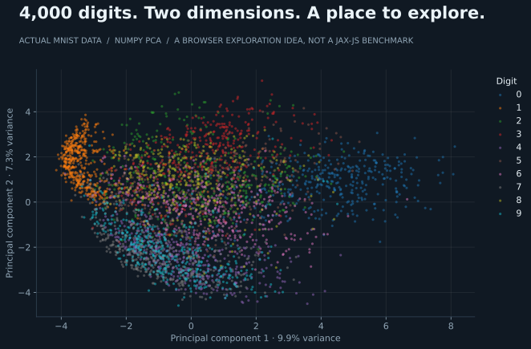

# jax-js: take the experiment into the browser

The same digits, viewed as a landscape: each point is one image, colored by its label. This PCA plot is computed from MNIST with NumPy; **it is data exploration, not a jax-js benchmark**. A browser version could let us select points, inspect mistakes, and watch representations change during training.

## TODO: a runnable WebGPU experiment

Use [jax-js](https://github.com/ekzhang/jax-js) to implement the MLX experiment's 784 → 128 → 10 ReLU MLP, normalized pixels, Adam at 0.001, and fixed dataset prefixes. Pin the dependency, record seeds, and report accuracy alongside synchronized training and inference timings. Matching seeds across frameworks does not guarantee matching initial weights; export shared weights for a strict inference comparison.

Start with the official [MNIST browser demo](https://jax-js.com/mnist). The reported subsecond result in [Eric Zhang's post](https://x.com/ekzhang1/status/2095713466174583152?s=20) is motivation to investigate; that specific claim has not been verified here.

Record browser, hardware, WebGPU/Wasm backend, workload, first-run compilation, warm performance, and download time separately. The first useful artifact should let someone train, save weights, reload, and predict without a Python service.

JaDE currently renders project HTML in a sandbox that does not execute scripts. The runnable experiment will need a separate local development server or an explicitly designed execution path; simply linking a training page in the preview will not run it.
