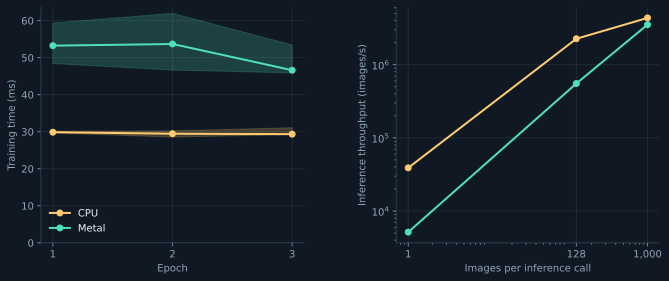

# MLX: a small model, a real Apple GPU

The [shared MNIST MLP](../jade.md) in ordinary Python, with automatic differentiation and Adam. This implementation uses eager execution without custom kernels or explicit compilation.



## Run

With [uv](https://docs.astral.sh/uv/) installed on an Apple-silicon Mac:

```sh
../fetch.sh
uv run --script --locked mnist.py
uv run --script --locked mnist.py --device cpu
uv run --script --locked mnist.py --weights results/gpu/model.safetensors --output results/reloaded
```

GPU is the default. Each run saves weights, metrics, and a short report under `results/<device>/`. Loading weights skips training and repeats the inference benchmark. Use `--help` to change dataset sizes, epochs, batches, or repetitions. Dependencies are pinned by the script lockfile.

## Read the measurements

[measurements.json](measurements.json) preserves the CPU/GPU runs behind this chart and the parent overview. Training includes shuffling, batch selection, gradients, updates, and parameter evaluation; per-epoch test evaluation is excluded. Inference includes Python dispatch and output evaluation, with five warmups before 50 measured calls. Downloads, setup, and checkpoint writes are outside timing; first calls may reuse shader caches.

Every timed output is explicitly evaluated because [MLX evaluates lazily](https://ml-explore.github.io/mlx/build/html/usage/lazy_evaluation.html). Both recorded runs reached 924/1,000 correct. Tiny batches favored the CPU.

Rebuild every chart with `uv run --script --locked ../plot.py`; no training or dataset download is required.
