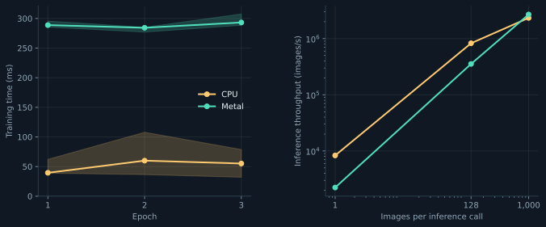

# Mojo / MAX



| Implementation | Setting |
| --- | --- |
| Model, optimizer, timing | [Shared protocol](../jade.md#protocol) |
| Graph + explicit derivatives | [model.py](model.py) |
| Custom activation | [kernels/relu.mojo](kernels/relu.mojo) |
| Runner | [compare.py](../compare.py): MAX adapter |
| Numerical checks | [verify.py](verify.py): finite differences, forward pass, Adam |
| Results | [measurements.json](../measurements.json): `max-cpu`, `max-gpu` |

## Run

From this folder, with `pixi`:

```sh
../fetch.sh
pixi run --locked python ../compare.py --backend max --device cpu
pixi run --locked python ../compare.py --backend max --device gpu
pixi run --locked python verify.py --device cpu
pixi run --locked python verify.py --device gpu
```

Apple GPU execution requires Xcode's Metal Toolchain. The environment pins MAX 26.5.0 and Mojo 1.0.0. macOS CPU and Metal are tested; the Linux environment is locked but untested here.

Separate graphs: training batches 128 and 16; inference batches 1, 128 and 1,000. Graph compilation is recorded separately from execution. First timed calls can reuse compiler/driver caches. Raw results: `../results/max-{cpu,gpu}.json`.

## Recorded graph compilation

<!-- measurements -->

| Graph | CPU · s | Metal · s |
| --- | ---: | ---: |
| Train 128 | 1.611 | 19.052 |
| Train 16 | 1.385 | 17.330 |
| Infer 1 | 1.347 | 1.303 |
| Infer 128 | 1.413 | 11.521 |
| Infer 1,000 | 1.350 | 12.066 |

<!-- /measurements -->

## Chart

```sh
uv run --script --locked ../plot.py
```
