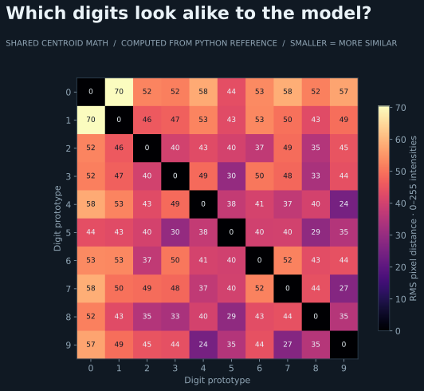

# Mojo / MAX: explore the stack from the kernel upward



The heatmap shows distances between the shared baseline's digit prototypes, computed by `plot.py` from the Python reference. It visualizes the math of the existing Mojo implementation; it does not measure GPU execution or Mojo latency.

## Runnable reference

```sh
../fetch.sh
pixi run --locked mnist
```

The current `mnist.mojo` is a native CPU nearest-centroid classifier. Its 773/1,000 result checks the translation's aggregate correctness. The [short paper](paper.md) describes that reference.

## The experiment we actually want next

Explore a small GPU-accelerated training/inference path on Apple silicon: first a useful Mojo GPU operation, then how it integrates with MAX model execution. Compare the setup, code required, training step cost, checkpoint handoff, and inference latency with MLX. Use the shared MLP specification once supported; record gaps rather than silently changing the workload.

The goal is an understandable stack we can modify, with performance that justifies the complexity. CPU centroid parity is only a starting point. Apple GPU coverage and training support must be checked against the pinned Mojo/MAX version; the current Pixi environment installs Mojo, not the full MAX serving stack.
