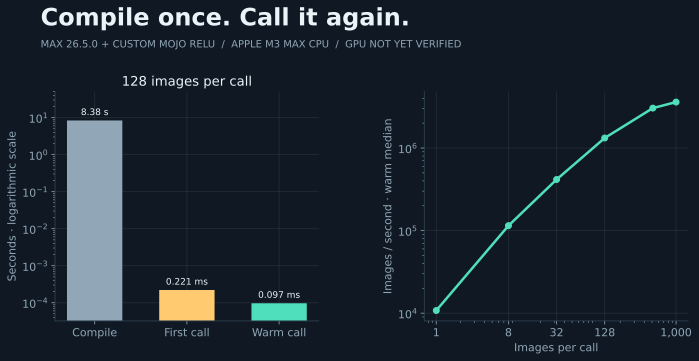

# Mojo / MAX: own the operation, run the graph



A small MLP with a **Mojo ReLU inside a MAX graph**. Train it, save the weights, reload them, and measure inference across batch sizes. The plot records a CPU run on an Apple M3 Max; GPU execution is still unverified on this machine because Apple's Metal compiler is missing.

## Run

With [Pixi](https://pixi.sh) installed, from this directory:

```sh
../fetch.sh
pixi run --locked python run.py --device cpu
pixi run --locked python run.py --device cpu --weights results/cpu/model.npz --output results/reloaded
pixi run --locked python verify.py
```

For an accelerator, choose `--device gpu`. On a Mac, the [Metal toolchain](https://docs.modular.com/max/packages) is required. With full Xcode installed and selected, install it using `xcodebuild -downloadComponent MetalToolchain`. Command Line Tools alone were insufficient here. The experiment reports a missing prerequisite rather than silently switching devices.

The environment pins MAX 26.5.0 and its accompanying Mojo toolchain. Results and checkpoints stay in `results/<device>/`; compilation time is recorded separately from execution.

## What to explore

[model.py](model.py) expresses the MLP and explicit backpropagation/Adam updates using MAX operations. [kernels/relu.mojo](kernels/relu.mojo) owns one activation; MAX handles the matrix operations. This is a deliberately small experiment in control and integration, not a general training library or evidence about LLM serving.

The [paper](paper.md) describes the workload and timing boundaries. The earlier native CPU centroid reference remains runnable with `pixi run --locked mnist`; its [prototype distances](distances.svg) show which digit averages resemble one another.
