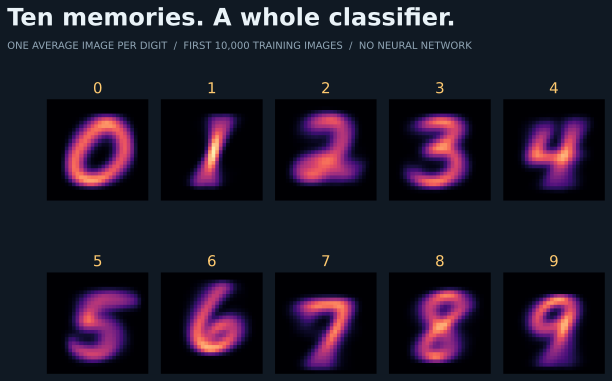

# Python baseline



Nearest-centroid, standard library only: average one image per digit, closest centroid wins.

```sh
../fetch.sh && uv run mnist.py ..
```

The model drawn as ten centroids: `report.md`. Machine-readable: `metrics.json`. Expected accuracy: **0.773**.
